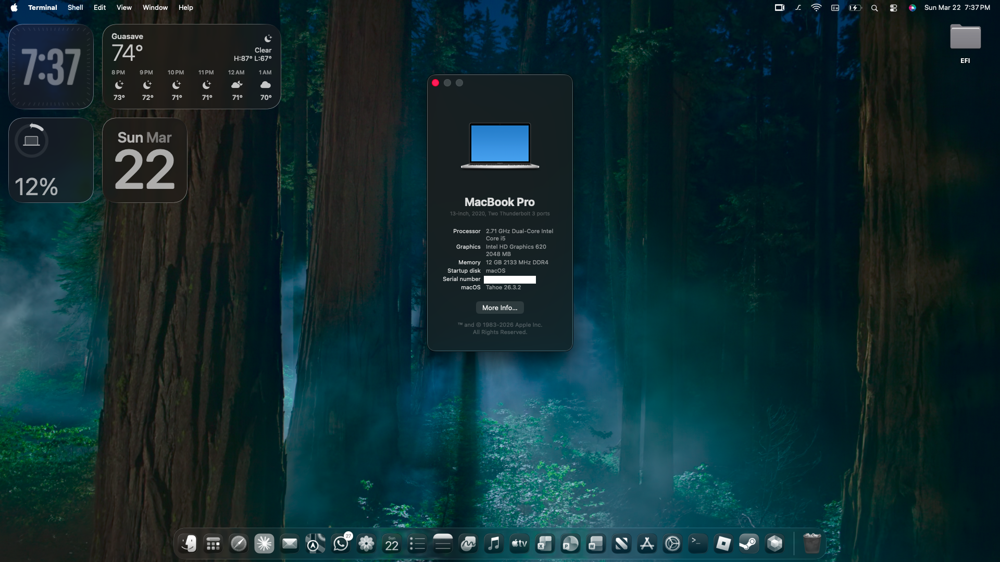

<h1 align="center">💻 ThinkPad T480 — macOS Tahoe EFI</h1>
<p align="center">
  <b>OpenCore EFI for running macOS Tahoe on the Lenovo ThinkPad T480 Kaby Lake</b>
</p>

<p align="center">
  
  
  
</p>
---

## 🚀 Hardware Specs

| Component   | Details                              |
| ----------- | ------------------------------------ |
| **Model**   | Lenovo ThinkPad T480                 |
| **CPU**     | Intel Core i5-7300U vPro (Kaby Lake) |
| **RAM**     | 12 GB DDR4                           |
| **Storage** | 240 GB NVMe SSD                      |
| **iGPU**    | Intel HD Graphics 620                |
| **SMBIOS**  | MacBookPro16,3                       |

---

## 📸 Screenshots

<p align="center">
  <br>
  <b>macOS Tahoe running on ThinkPad T480</b>
</p>

---

## ✅ What Works

| Feature                 | Status | Details                |
| ----------------------- | ------ | ---------------------- |
| Boot                    | ✅      | Stable                 |
| Sleep / Wake            | ✅      | No issues              |
| Wi-Fi                   | ✅    | Native Menu! (Requires OCLP-Mod)     |
| Audio                   | ✅      | OCLP-Mod only          |
| Native GPU Acceleration | ✅      | Works out of the box   |
| Brightness Keys         | ✅      | Functional             |
| Battery Management      | ✅      | Working                |
| USB Ports               | ✅      | All functional         |
| TrackPoint              | ✅      | Fully functional       |
| 3.5mm Jack              | ✅      | Functional             |
| Bluetooth               | ✅      | Functional             |
| Trackpad Gestures       | ✅      | Working (New!)         |
| External Display Boot   | ✅      | Solved (New!)          |
---

## ❌ Not Working

| Feature                        | Status | Notes                    |
| ------------------------------ | ------ | ------------------------ |
| iServices (iMessage, FaceTime) | ❌     | Impossible*              |
| Thunderbolt                    | 🔲     | Not tested               |


*: IServices will not work, i researched and Tahoe has tighten his security, now it checks AMFI, SIP and other things, this EFI uses Root Patches and CPU Spoofing that require AMFI and SIP disabled to work, so its impossible.
---

## 📋 Requirements

> [!WARNING]
> This EFI is **not plug-and-play**.
> You should understand how OpenCore works (editing `config.plist`, SMBIOS, patches).

Read before using:
https://dortania.github.io/OpenCore-Install-Guide/

---

## 🛠️ Post-Install

### 🧬 1. Generate your own SMBIOS

⚠️ **Do NOT use included serials** (they are placeholders)

Steps:

1. Open GenSMBIOS
2. Select:

   ```
   MacBookPro16,3
   ```
3. Copy values into:
   `PlatformInfo → Generic`

Required fields:

* SystemSerialNumber
* MLB
* SystemUUID
* ROM (your MAC address without colons)

Check your serial here:
https://checkcoverage.apple.com
It should say: **"Purchase Date not Validated"**

---

### 🔊 3. Apply OCLP-Mod (Audio Fix)

* Standard OCLP patches do **not** fix audio
* Use **OCLP-Mod** instead
* Apply root patches after installation

---

### 🔄 4. Reset NVRAM

On first boot:

* Open OpenCore picker
* Select **Reset NVRAM**
* Then boot into macOS

---

## 🙌 Credits

* Dortania — OpenCore Install Guide
* OCLP — Legacy Patcher
* OpenIntelWireless — AirportItlwm
* Acidanthera — OpenCore, Lilu, WhateverGreen, AppleALC
* MultimediaLucario — Base T480 EFI
* LaObaMac — OCLP-Mod

---

<p align="center">
  Made for the ThinkPad T480 community 🧠💻
</p>
